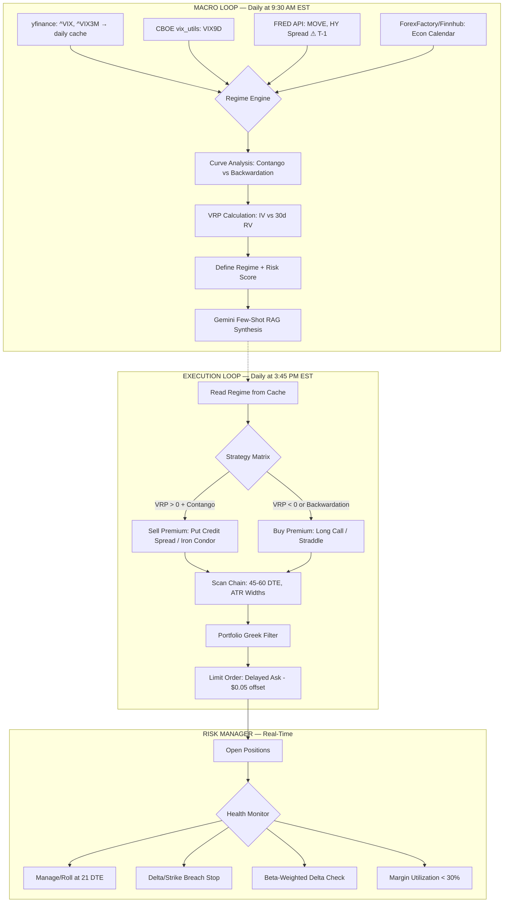

# AI Macro Strategy: Institutional Grade (V2)

This document outlines the upgraded architectural logic of the **AI Options Trader**, transitioning from a theoretical framework to an institutional-grade volatility strategy — built entirely on **zero-cost data sources**.

---

## 1. The Dual-Loop Architecture

The system operates via two distinct, asynchronous loops to separate macro sentiment from execution. The **Macro Loop** runs at market open; the **Execution Loop** runs at 3:45 PM EST to sidestep Alpaca's 15-minute OPRA data delay.

---

## 2. Zero-Cost Data Stack

| Data | Source | Notes |
|---|---|---|
| VIX / VIX3M | `yfinance` (`^VIX`, `^VIX3M`) | Free, cached daily to avoid rate limits |
| VIX9D | CBOE `vix_utils` or `yfinance` (`^VIX9D`) | Daily CSV from CBOE |
| MOVE Index | FRED API (`BAMLMOVE`) | Free with API key, **⚠ T-1 lag** |
| HY Credit Spread | FRED API (`BAMLH0A0HYM2`) | Free, daily, **⚠ T-1 lag** |
| DXY | `yfinance` (`DX-Y.NYB`) | Free |
| Realized Volatility | Computed from SPY historical bars | Free (yfinance) |
| Economic Calendar | **ForexFactory JSON / Finnhub Free Tier** | Free, pulled at 8:00 AM EST |
| Options Chain + Greeks | Alpaca (existing) | Free paper trading tier, 15-min delay |
| AI Synthesis | Gemini (Google AI Pro) | Included in subscription |

---

## 3. Institutional Regime Detection

### A. VIX Term Structure (Contango vs Backwardation)
Instead of using VIX in isolation, we analyze the **volatility curve**:
*   **Contango (VIX9D < VIX < VIX3M)**: Normal market equilibrium. Safe to harvest Theta via premium selling.
*   **Backwardation (VIX9D > VIX)**: Active panic/distress signal. **All premium selling is paused.** The system pivots to Long Vega plays or cash.

### B. Volatility Risk Premium (VRP)
The **decision to sell or buy premium** is no longer based on absolute VIX levels. Instead:
*   **VRP = Implied Volatility (VIX) − Realized Volatility (30-day SPY)**
*   **VRP > 0**: Premiums are "rich" → Sell premium (Put Credit Spreads, Iron Condors)
*   **VRP < 0**: Premiums are "cheap" → Buy premium (Long Calls, Straddles)

### C. Cross-Asset Confirmation
Before committing to a regime, we cross-reference:
*   **MOVE Index > 120**: Bond market stress → pause equity premium selling
*   **HY Spread widening > 50bps in a week**: Credit deterioration → defensive posture
*   **DXY surging**: Dollar strength → headwind for equities and commodities

---

## 4. Upgraded Trade Mechanics

### The 45/21 Rule
*   **Entry**: 45 to 60 DTE. This captures the "sweet spot" of the Theta curve.
*   **Exit**: All short positions are closed or rolled at **21 DTE**. No exceptions.

### Dynamic Strike Selection (ATR-Based)
*   **Minimum spread width**: $5 (eliminates commission drag)
*   **Dynamic width**: `max($5, ATR_14 × 1.5)` — wider spreads for volatile underlyings
*   **Short strike placement**: Minimum 1 standard deviation OTM

---

## 5. LLM Pipeline: Grounded Synthesis

### Anchored Few-Shot Prompting
The Gemini prompt includes concrete historical calibration examples to ensure consistent 0-100 scoring:

| Example Scenario | Target Score |
|---|---|
| VIX 13, Fed cuts rates, unemployment 3.5%, contango | 15 |
| VIX 20, mixed earnings, CPI in-line | 45 |
| VIX 28, regional bank stress, backwardation | 75 |
| VIX 40+, sovereign crisis, MOVE > 150 | 95 |

### Economic Calendar RAG
Instead of raw headlines, the LLM receives **structured economic event data** pulled from **ForexFactory** or **Finnhub's free calendar** API at 8:00 AM EST daily:
> *"Today is CPI Day. Forecast: 3.1%. Actual: 3.4% (miss). Previous: 2.9%."*

This grounds the AI in hard data rather than sensationalist clickbait.

### T-1 Data Awareness
FRED API data (MOVE Index, HY Spread) runs on a **T-1 day lag**. The prompt explicitly tells Gemini:
> *"MOVE and HY Spread data is as of [Yesterday's Date]. VIX is real-time. Synthesize accordingly."*

This prevents hallucinated conflicts between a real-time VIX spike and yesterday's calm bond market.

---

## 6. Risk Management: Portfolio Greeks

### Delta-Based Stops (Not P/L %)
We eliminate the `-25% P/L hard stop` which is vulnerable to wide bid/ask spreads. Instead:
*   **Stop trigger**: Underlying price breaches the short strike, OR short leg Delta exceeds 0.40
*   **Execution**: Limit orders with a **price offset** (Delayed Ask - $0.05) to account for Alpaca's 15-minute OPRA delay, rather than unreliable mid-point pegs

### Portfolio-Level Guardrails
*   **Beta-Weighted Delta to SPY**: Ensures the entire portfolio isn't accidentally stacked in one direction
*   **Margin Utilization**: Hard ceiling of **30% of buying power** to survive Black Swan events
*   **Circuit Breaker**: If margin > 30% OR |BWD| > threshold → block new trade entries

---

## 7. Technical Stack

| Component | Technology | Cost |
|---|---|---|
| AI Model | Gemini (via Google AI Pro subscription) | Included |
| Model Walking | Flash-Lite → Flash → Pro fallback chain | Included |
| Market Data | yfinance + FRED API + CBOE vix_utils (daily cache) | Free |
| Options Data | Alpaca (paper trading, 15-min delay) | Free tier |
| Economic Calendar | ForexFactory JSON / Finnhub Free Tier | Free |
| Execution Timing | Daily at 3:45 PM EST (post-delay stabilization) | N/A |

---

> [!IMPORTANT]
> This AI strategy is designed for **Paper Trading** and educational purposes. Option trading involves high risk, especially in high-volatility regimes where multi-leg spreads can experience significant margin expansion.
